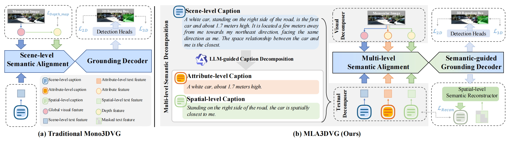
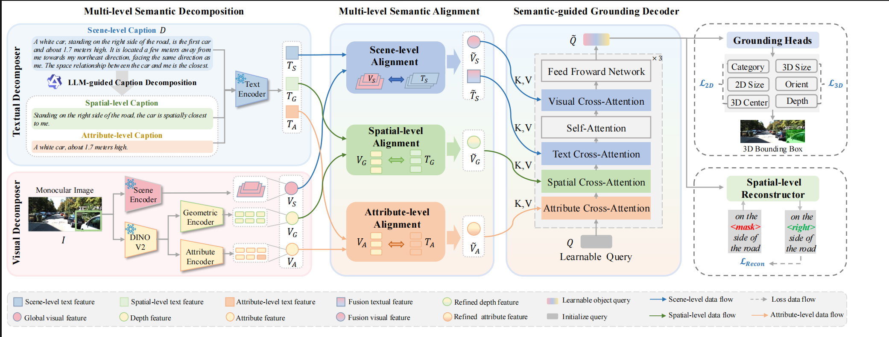

# MLA3DVG: Dual-Modality Multi-level Semantic Alignment for Robust Monocular 3D Visual Grounding

---
 we propose **MLA3DVG**, a dual-modality framework for **Monocular 3D visual grounding** that infers object locations in 3D space using only RGB inputs and language description. We explicitly models and aligns multi-level semantics across visual and textual modalities. Specifically, we decomposes both textual and visual inputs into scene-, attribute-, and spatial-level representations, capturing fine-grained geometric features for richer spatial understanding. These representations are subsequently integrated through a **Multi-Level Semantic Alignment (MLSA) mechanism**, which enables fine-grained, level-wise cross-modal alignment. 

  

  

## 🚧 Code Release

⌛ **We've released some key code, and will be adding tutorials later. Stay tuned!**

---

## 💡 Key Features

* **Monocular 3D Visual Grouding:**  Infer object locations in 3D space using only RGB inputs and language description.
* **Multi-level Semantic Alignment:** We design multi-level semantic decomposition and alignment modules that explicitly model scene-, attribute-, and spatial-level semantics across textual and visual modalities, enabling layer-level alignment for global context and token-level alignment for key attributes and spatial relations.
* **Notable improvements:**  notable improvements in challenging scenarios involving long-range targets and multiple similar objects.

